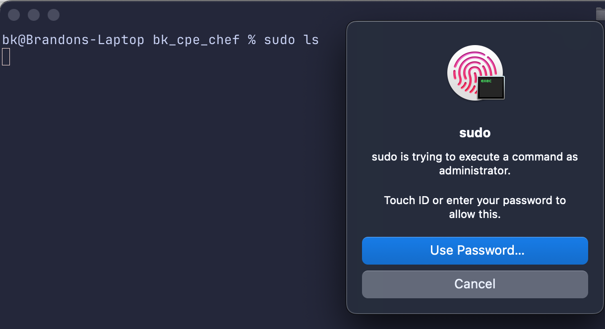

# Using Chef the Facebook way

## Who is this tutorial for?

- Anyone who wants to learn how Facebook's way to use Chef. But particularly [Client Platform Engineers](https://kanenarraway.com/posts/client-platform-engineering/) who are new to Chef.

## Background

What is the Facebook way? Read over [https://github.com/facebook/chef-utils/blob/main/Philosophy.md](https://github.com/facebook/chef-utils/blob/main/Philosophy.md). It's okay if you don't understand most or even any of the content right now. Return to it after walking through this tutorial.

## Tutorial

### Prerequisites

Install [cinc](https://downloads.cinc.sh/files/stable/cinc), the fully open-source soft-fork of Chef, **or** [Chef Infra client](https://community.chef.io/downloads/tools/infra-client).

> If you use `cinc-client`, alias it to `chef-solo` to follow the tutorial.

```bash
alias chef-solo=cinc-solo
```

### Tutorial

> **Tip** on how to use this tutorial: Follow each link and read through the content. This will give important context about various concepts within Chef.

#### Goal #1: Enable TouchID for sudo

1. Run `chef-solo` with quickstart.json from the root of this repository:

    ```
    sudo chef-solo -z -j quickstart.json --config-option cookbook_path=cookbooks --force-formatter
    ```

    This should produce output which contains the following:

    ```
    ...
    Recipe: cpe_touchid::default
    * cpe_touchid[Configure TouchID] action manage (up to date)

    Running handlers:
    Running handlers complete
    Infra Phase complete, 0/1 resources updated in 04 seconds
    ```

    So what happened?

    Nothing happened yet (`0/1 resources updated`)!

1. But if we create a file at `/Users/Shared/manage_touchid`, then TouchID for sudo should be enabled!
    1. Run `chef-solo` again

        ```
        sudo chef-solo -z -j quickstart.json --config-option cookbook_path=cookbooks --force-formatter
        ```

        Check the output to see what happened.

        ```
        ...
        Recipe: cpe_touchid::default
        * cpe_touchid[Configure TouchID] action manage
            * template[/etc/pam.d/sudo_local] action create
            - create new file /etc/pam.d/sudo_local
            - update content in file /etc/pam.d/sudo_local from none to 56fc33
            --- /etc/pam.d/sudo_local 2025-01-28 22:59:16.230962931 -0800
            +++ /etc/pam.d/.chef-sudo_local20250128-22138-hnwnce      2025-01-28 22:59:16.191995518 -0800
            @@ -1,3 +1,6 @@
            +# sudo_local: local config file which survives system update and is included for sudo
            +# uncomment following line to enable Touch ID for sudo
            +auth       sufficient     pam_tid.so
            - change mode from '' to '0644'
            - change owner from '' to 'root'
            - change group from '' to 'wheel'
        Running handlers:
        Running handlers complete
        Infra Phase complete, 2/2 resources updated in 06 seconds
        ```

        If you try to use `sudo` in a Terminal now, you'll be prompted to use TouchID instead of your password. Neato!

        


        > **Let's pause for a minute and walk through what happened**:
        > - We changed a `node` attribute* (think of this as a feature flag) which causes `cpe_touchid` to actually potentially change stuff. See [cookbooks/company_config/recipes/default.rb](cookbooks/company_config/recipes/default.rb). We set `node.default['cpe_touchid']['manage'] = true` and `node.default['cpe_touchid']['enable'] = true`.
        > - Why does this cause `cpe_touchid` to get activated? Take a look at [the cpe_touchid resource](cookbooks/cpe_touchid/resources/cpe_touchid.rb) source code.
        >   1. The `chef-solo` command we ran references [quickstart.json](quickstart.json). This file defines a runlist for Chef.
        >       ```json
        >       {
        >            "minimal_ohai" : true,
        >            "run_list": [
        >               "recipe[cpe_init]" # equivalent to recipe[cpe_init::default]
        >            ]
        >        }
        >       ```
        >       Chef interprets this runlist by looking in the configured cookbook directory at the `cpe_init` cookbook and looking for [cookbooks/cpe_init/recipes/default.rb](cookbooks/cpe_init/recipes/default.rb).
        >   1. Inside this recipe, two more recipes are called: `company_config` and `cpe_touchid`.
        >      - `company_config`, as we've seen simply sets some node attributes.
            >      - `cpe_touchid` consumes the node attributes and executes stuff based on their ate.
        >   1. In [cookbooks/cpe_touchid/recipes/default.rb](/cookbooks/cpe_touchid/recipes/default.rb) we simply see `cpe_touchid_configure 'Configure TouchID'` with no arguments/attributes. To figure what's happening here we have to look at the source code for this resource: [cookbooks/cpe_touchid/resources/cpe_touchid.rb](cookbooks/cpe_touchid/resources/cpe_touchid.rb)
        >   1. The default action, `default_action :manage`, is `manage`, so we look inside `action :manage` there are these lines:
        >       ```ruby
        >       enable if node['cpe_touchid']['manage'] && node['cpe_touchid']['enable']
        >       disable if node['cpe_touchid']['manage'] && !node['cpe_touchid']['enable']
        >       ```
        >       If we are managing TouchID and `enable` is true, we call the `enable` function.
        >
        >       If we are managing TouchID and `enable` is false, we call the `disable` function.
        >
        >   1. The `enable` function defines/calls a template resource (see [https://docs.chef.io/resources/template/](https://docs.chef.io/resources/template/)) which creates `/etc/pam.d/sudo_local`, if doesn't yet exist, using the [erb template](https://github.com/ruby/erb) defined in `cpe_touchid/templates/default/sudo_local.rb`.
        >   1. The `disable` function is not yet defined, but we will define that later.

        If you run `sudo chef-solo -z -j quickstart.json --config-option cookbook_path=cookbooks` again, you should see `Infra Phase complete, 0/1 resources updated in 04 seconds`.

        Why is it `0/1 resources updated` again? It's because the `template` resource is _idempotent_.

        > **What is idempotence?**
        >
        > In Chef, idempotence refers to the property where running the same Chef recipe multiple times results in the same system state, without causing unintended side effects.
        >
        > **How Idempotence Works in Chef**
        > - Check Before Change: Chef resources (like file, package, service) first check the system's current state before making any changes.
        > - Apply Only If Needed: If the system is already in the desired state, Chef does nothing; otherwise, it makes the necessary changes.
        > - Consistent Results: Running the recipe multiple times should not change the system beyond the initial intended configuration.

    > Woo! You've made it this far! Let's make this more complicated.

#### Goal 2: Delete `/etc/pam.d/sudo_local` if `node['cpe_touchid']['enable']` is `false`

1. Implement the disable function in [cookbooks/cpe_touchid/resources/cpe_touchid.rb](cookbooks/cpe_touchid/resources/cpe_touchid.rb) so that if `node['cpe_touchid']['enable']` is `false`, `/etc/pam.d/sudo_local` is deleted.

> **Note**: Implementing deletion through `node['cpe_touchid']['enable'] = false` instead of introducing `node['cpe_touchid']['disable'] = true` has an important benefit:
> - We can simply erase code which has the side effect of deleting files on disk because the default value for `node['cpe_touchid']['enable']` is `false`. This default is set in [cookbooks/cpe_touchid/attributes/default.rb](cookbooks/cpe_touchid/attributes/default.rb).
> - We don't have to go back later and clean up orphaned code that isn't needed anymore. We would otherwise have to go back and cleanup explicit deletion code.

#### Goal 3: Creating dynamic json files from node attributes
